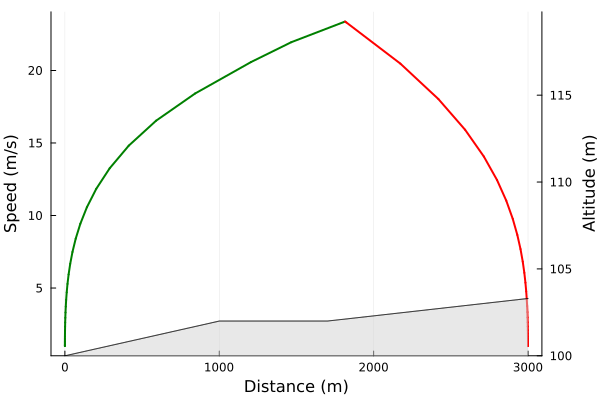
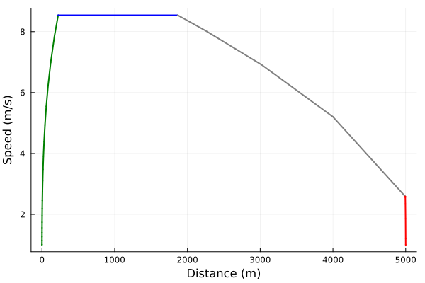
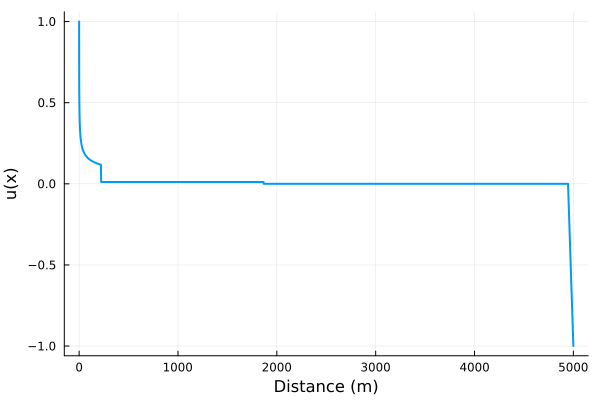

# Time-Optimal Train Control (TOTC) Example
Consider the problem of finding the time-optimal speed profile on a flat track of length $3\ \mathrm{km}$. At first we need to define a `Train` and a `Track` which will form the basis of our problem.

Each `Train` has upper and lower limit of its traction capabilites (specified as a Julia function of speed) and coefficients of a quadratic representing the speed-dependent train's mechanical and aerodynamical resistance.
```julia
train = Train(
    v ->  3/v,
    v -> -3/v,
    (6.75e-3, 0., 5e-5)
)
```

The only required argument for a `Track` is its length, however one can also specify its altitude and points of changing track grade.
```julia
track = Track(
    length = 3e3,
    altitude = 100.,
    x_gradient = [0.0, 1e3, 1.7e3],
    gradient = [2e-3, 0., 1e-3]
)
```

We are now ready to construct a time-optimal train control problem and solve it!
```julia
prob = TOTCProblem(train, track)
sol = solve(prob)
plot(sol)
plot!(twinx(), track)
```


The colours are showing the control mode which is currently engaged (green for maximum traction, red for maximum braking).

# Energy-efficient Train Control Problem Example

In contrast to the previous example, energy-efficient 
train control (EETC) problems minimize the criterion
```math
\mathrm{min}\ J=\mathrm{min} \int\limits_0^X \left( \frac{u+|u|}{2} + \rho\frac{u-|u|}{2} \right)\mathrm{d}x,
```
where $x$ is the distance along the track, $u$ is traction effort of the train and $\rho\in[0,1]$ is the proportion of mechanical energy recovered during braking.
The problem is to minimize the functional $J$ while also satisfying the requirement of the total journey time.

Let's construct a $5\ \mathrm{km}$ flat track,
```julia
track = Track(
    length = 5e3
)
```
and a train (the fourth argument is $\rho$):
```julia
train = Train(
    v -> 1/v,
    v -> -1/v,
    (1e-2, 0., 1.5e-5),
    0.6
)
```

Suppose, we want to arrive at our destination after $T=800\ \mathrm{s}$ and so we plug this requirement into
our definition of an EETC problem:
```julia
T = 800.
prob = EETCProblem(T, train, track)
sol = solve(prob)
plot(sol)
```


The colours specify the currently engaged control mode (green for maximum traction, blue for cruising, gray for coasting and red for maximum braking).

One can also inspect the optimal control signal throughout the trip:
```julia
plot(sol.control, 0, track.length)
```
